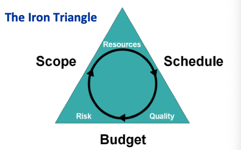
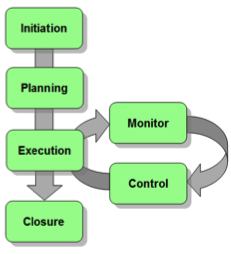

# Introduction to Project Management

## The Iron Triangle

:::info
#### Other Project Constraints
- Risk
- Resources
- Quality
:::

### Scope

:::note
The scope is the work that must be performed to deliver a product, service or result with the specified features and functions
:::

#### Project Charter
  - Project goal
  - Project participants
  - Stakeholders
  - Requirements
  - Constraints
  - Milestones
  - Communication
  - Deliverables

### Schedule

:::note
The schedule is the actual time required to produce a deliverable
:::

- Time in project management is analyzed to the smallest detail
- Tools: Microsoft Project and the Work Breakdown Structure (WBS)

### Budget

:::note
The Budget is the estimation of the amount of money that will be required to complete the project
:::

Cost itself encompasses various things
* Resources
* Labor rates for contractors
* Risk estimates
* Bills of materials

## What is a project

- A project is an activity that:
  - is temporary having a start and end date
  - is unique
  - brings about change
  - has unknown elements, which therefore create risk
- Generally projects are formed to solve a problem or take advantage of an opportunity.
- business as usual activities can often be mistaken for projects.
- generally it is the uniqueness of the activity that is the deciding factor - do we do this every year? If so, then it is not truly a project - although you can use project methods to get it done

### Common Project Terms

- Deliverables: Tangible ‘things’ that the project produces
- Milestones: Dates by which major activities are
performed.
- Tasks: Also called Actions. Activities undertaken during
the project
- Risks: Potential problems that may arise
- Issues: Risks that have happened
- Gantt Chart: A specific type of chart showing time and
tasks. Usually created by a Project Management program
like MS Project.
- Stakeholder: Any person or group of people who may be
affected by your project

## Project Lifecycle Stages

* Every Project has a lifecycle (no matter the size or complexity)
* The lifecycle helps to:
  - Ensure the project meets the objectives of the agency
  - Efficiently plan and organize resources for each activity
  - Objectively measure achievement of goals
  - Justify the decision to move ahead, correct or terminate the project
  - Deliver projects on time and within budget
  - Improve the success of the project.

### Initiation Stage

Questions to be answered in the initiation stage include the following:
- Why this project?
- Is it feasible?
- Who are possible partners in this project?
- What should the results be?
- What are the boundaries of this project (what is outside the scope of the project)?

### Planning Stage

Tasks in the Planning Stage include:
- Create a communication plan
- Develop a detailed work breakdown structure
- Identify the critical path.
- Plot resources and refine the sequencing of the work
- Identify resource constraints
- Develop a detailed schedule
- Assess risks and develop a risk prioritization and mitigation plan.

### Execution Stage

Tasks in the Execution Stage include: 
- Ensure you have a solid project plan 
- Resources have been assigned
- Project Team has assigned tasks

### Monitor and Control Stages

Tasks in the Monitor and Control Stages include:
- Adhering to the pre-established communication plan
- Monitoring work teams and work activities on the critical path
- Identifying opportunities to improve schedule performance
- Monitoring actual versus planned costs
- Monitoring, calculating and reporting on earned value
- Monitor and mitigating risks

### Closure Stage

Tasks in the Closure Stage include:
- The closing of a project is just as important as its initiation, planning and execution.
- It is recommended that the Project Manager hold a post-mortem on the project to reflect on what went right, or wrong during the project.
- Formally adjourn the project team.

---
## Reference
* https://iahd.com/wp-content/uploads/2018/11/Introduction-to-Project-Management.pdf
* https://www.edo.ca/downloads/project-management.pdf