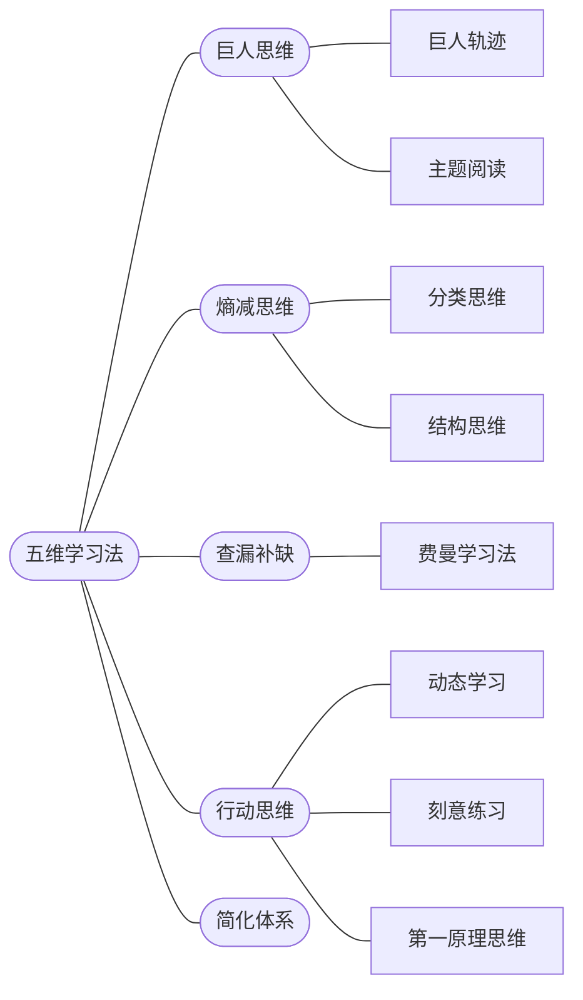

# 五维学习法

## 一辈子只用这5个学习方法就够了

如何快速的成为某领域专家

## Reference

https://t.qianzhan.com/daka/detail/210817-c61ae77e.html

30 二少学习力发布了一篇小红书笔记，快来看吧！ 😆 OaHKRvwYWrlHVzp 😆 http://xhslink.com/htUWbU，复制本条信息，打开【小红书】App查看精彩内容！