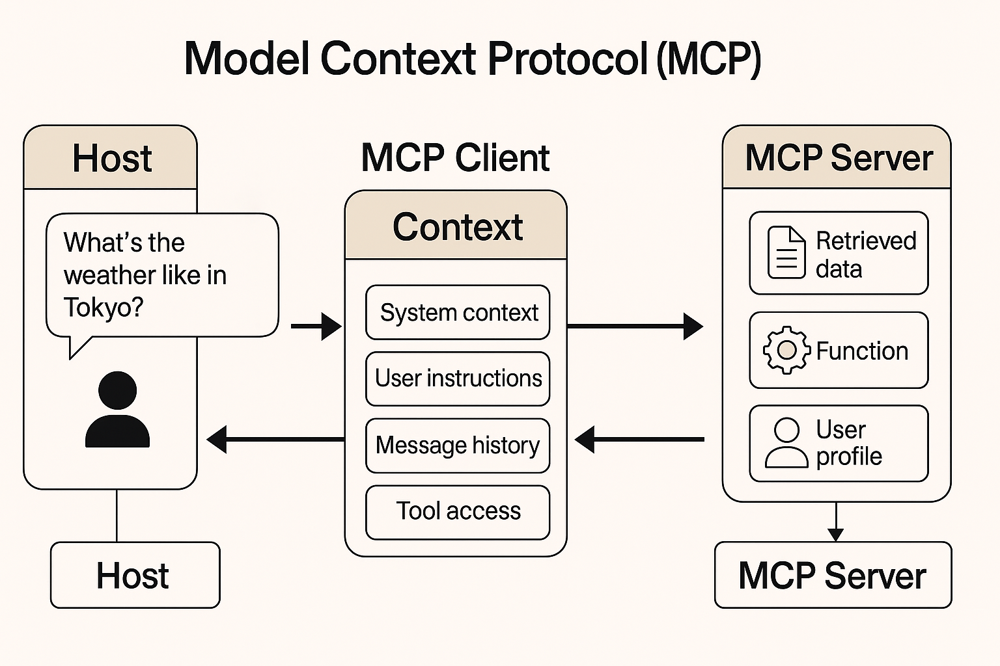
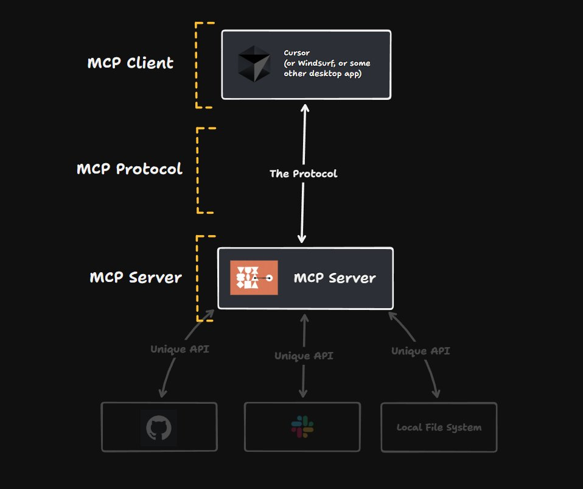

# Model Context Protocol (MCP)



The **Model Context Protocol (MCP)** is an open standard for structuring and delivering context to large language models (LLMs). It’s often described as a “USB-C port for AI”: a universal interface that connects an LLM to the various data sources, tools, and instructions it needs. By providing a **single, standardized protocol** for context, MCP lets developers plug any compliant AI model into any compliant data source or tool without custom glue code. This solves the common problem where each new database, API, or service would otherwise need its own integration, making AI-powered apps hard to build and scale. In short, MCP creates a **uniform way to share prompts, data, and tools with LLMs**, helping models produce more reliable and relevant responses.


## How MCP Structures Context

At its core, MCP treats *all* contextual inputs as structured data, not just free-form text. An MCP context payload is typically a JSON (or YAML) object with well-defined sections. These sections can include:

* **System instructions:** The base directives or persona for the LLM (e.g. “You are a helpful assistant.”). These set the overarching behavior or rules for the model.
* **User input or goal:** The current user’s query or intent. This is the new prompt or message the user sends.
* **Tool descriptions:** Metadata about external functions or APIs the model can call (e.g. a calculator, database query, or custom API). MCP standardizes how tools are declared and invoked so the LLM “knows” what it can use.
* **Retrieved data/documents:** Any information fetched from databases, knowledge bases, or search (often via retrieval-augmented generation). These are packaged as part of the context (for example, a list of relevant documents) for the model to reference.
* **Memory/History:** Past conversation turns, user profile data, or other long-term state. MCP can include *memory objects* (previous messages or facts) and *chat history* so the assistant can maintain continuity across turns.

For example, a simplified MCP context might look like:

```js
{
  "system_instruction": "You are a personal shopping assistant.",
  "user_goal": "Find budget-friendly laptops.",
  "tools": ["price_search", "reviews_lookup"],
  "retrieved_documents": [...],
  "chat_history": [...],
  "memory": {"preferred_brand": "Lenovo"}
}
```

This clearly separates *what the model is (system)*, *what the user wants (user\_goal)*, *what tools it has*, and *what it should remember*. An MCP client or router then *translates this structured context into the actual LLM prompt or API call* the model understands.

## Key Components in an MCP Context

* **System Instructions:** Base prompts or rules (personality, style guidelines, etc.) that set the LLM’s behavior.
* **User Input/Instructions:** The user’s current message or query, often as a field like `user_message` or `user_goal` in the context.
* **Tools/Capabilities:** Descriptions of functions or services the LLM can call (e.g. name and description of an API function). MCP standardizes these so the LLM can decide when and how to use them.
* **Memory & History:** Any prior conversation turns, user preferences, or session data. In MCP these are explicit fields (like `chat_history` or `memory`) that let the assistant recall past information.
* **Retrieved Data:** External information pulled in (documents, API data) to enrich the model’s context. These might come from a vector search, database query, or other “resources” exposed by an MCP server.

By defining these as distinct parts of the protocol, MCP makes context **clear and modular**. For instance, one implementation might package all tool metadata under a `"tools"` key, while another might list user preferences under `"user_profile"`. The LLM runtime can then iterate through each section when constructing its final prompt.



*Figure: Simplified MCP architecture. An LLM-based Host (e.g. a chat UI or IDE plugin) uses an MCP Client to connect (via JSON-RPC) to one or more MCP Servers. Each server exposes tools and data resources (files, APIs, databases) through a standardized interface. The Host can pass structured queries (and receive results) without custom integration code.*

## Architecture and Workflow

MCP follows a **host-client-server** model. The **Host** is the LLM application (for example, a chatbot UI like Claude Desktop or ChatGPT). The host embeds an MCP client library, which opens a stateful connection (over JSON-RPC 2.0) to one or more **MCP Servers**. Each MCP Server is a lightweight program that exposes specific capabilities (data or tools) to the host.

During operation, the Host sends JSON-RPC requests to the connected MCP servers. For example, the host might do something like `getTools` to discover what tool functions are available, or call `executeTool` with a payload. The server responds with structured data (e.g. API results, file contents). The host then assembles all pieces into the LLM’s prompt: it inserts the system instructions, the user’s message, any retrieved results, and so on, according to the MCP specification. In effect, each MCP server looks like a plug-in that the LLM can query at runtime, without the host needing custom code to talk to Slack, Google Drive, GitHub, etc.

In the embedded diagram, the host (with its MCP client) issues context or tool requests to two servers. Each server might have a “Unique API” (like Slack’s API, a local file system, or a database). Because MCP standardizes the message format, the host treats them uniformly. As the MCP specification notes, this approach enables **Resources** (context/data) and **Tools** (functions) to be cleanly separated and negotiated between host and servers. The protocol even supports things like capability negotiation, progress tracking, and error reporting out of the box.

## Benefits: Consistency, Reliability, Stateful Agents

By construction, MCP makes AI interactions more **consistent and reproducible**. Because every piece of context (system prompts, user data, tools) is explicit, developers can version and debug them. In MCP every context item is “versioned and traceable,” so you always know what was sent to the model and why. This separation of concerns means prompt engineering is less ad-hoc: instead of concatenating everything into one big string, the host code builds a structured object that the protocol encodes into the final prompt. The result is more reliable behavior across runs, even if the underlying LLM or data changes. As one author puts it, MCP “aims to enable consistent, interpretable, and interoperable interactions across LLM-based systems”. Early adopters report that integrating MCP dramatically cuts down on boilerplate integration code and reduces surprises when scaling up with new tools or models.

Crucially, MCP also **enables stateful interactions**. Because memory and history are first-class fields, agents can truly “remember” information across sessions. For example, a shopping assistant could store your preferences in `memory` and reuse them next time you chat, without manual prompt stitching. The builderlab article notes that MCP offers “better support for personalization, memory, and long-term interactions” in multi-turn agents. In practice, this means you can build chatbots or agents that carry context across multiple steps or days, and even switch between different LLM services, all while maintaining continuity.

## Example: Pseudo-Code

In practice, an MCP client library will handle the JSON-RPC calls. Here’s a **pseudo-code** sketch of how a developer might send a query through MCP:

```python
# Prepare structured context for the model
mcp_payload = {
    "version": "1.0",
    "system": "You are a helpful assistant.",
    "inputs": { "user_message": "Who won the game last night?" },
    "tools": [
        {"name": "sports_api", "description": "Retrieve latest sports scores."}
    ],
    "memory": {"favorite_team": "Lakers"}
}

# Use an MCP client to invoke the "answer" method with this context
response = mcp_client.send_request("answer", mcp_payload)

print(response["answer"])
```

In this example, the MCP client would translate `mcp_payload` into the final prompt sent to the LLM (including fetching any needed data via the `sports_api` tool). The exact method names and fields depend on the MCP schema, but the key idea is that the context stays structured and separate until the last step.

## Conclusion

For developers building on LLMs like ChatGPT or Claude, the Model Context Protocol offers a more rigorous and modular way to handle prompts. By **standardizing how system directives, user queries, tool invocations, and memory are packaged**, MCP makes LLM-based apps easier to develop, test, and maintain. It also future-proofs integrations: as new data sources or models emerge, an MCP-compliant host can immediately connect to any MCP-compliant server. In essence, MCP turns the context windows of LLMs into a well-defined data contract, leading to AI agents that are more stateful, consistent, and interoperable. For developers, this means focusing on *what* the AI should do rather than *how* to wire together its data and tools – much like how APIs abstract away the plumbing under the hood.

**Sources:** MCP is documented in an open specification and supported by Anthropic and community contributors. The descriptions here draw on the official spec and recent developer write-ups.


## Reference

[What is Model Context Protocol (MCP): Explained](https://composio.dev/blog/what-is-model-context-protocol-mcp-explained/)

