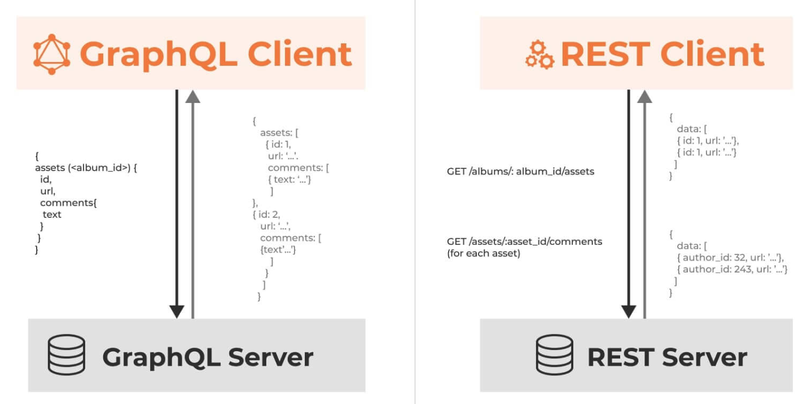

# GraphQL vs REST

## What’s the Difference Between GraphQL and REST?

GraphQL and REST are two distinct approaches to designing API for exchanging data over the internet. REST enables client applications to exchange data with a server using HTTP verbs, which is the standard communication protocol of the internet. On the other hand, GraphQL is an API query language that defines specifications of how a client application should request data from a remote server. You can use GraphQL in your API calls without relying on the server-side application to define the request. Both GraphQL and REST are powerful technologies behind most of our modern applications.

## GraphQL vs REST

|                                    | REST                                                                                                          | GraphQL                                                                                                                    |
| ---------------------------------- | ------------------------------------------------------------------------------------------------------------- | -------------------------------------------------------------------------------------------------------------------------- |
| What is it?                        | REST is a set of rules that defines structured data exchange between a client and a server.                   | GraphQL is a query language, architecture style, and set of tools to create and manipulate APIs.                           |
| Best suited for                    | REST is good for simple data sources where resources are well defined.                                        | GraphQL is good for large, complex, and interrelated data sources.                                                         |
| Data access                        | REST has multiple endpoints in the form of URLs to define resources.                                          | GraphQL has a single URL endpoint.                                                                                         |
| Data returned                      | REST returns data in a fixed structure defined by the server.                                                 | GraphQL returns data in a flexible structure defined by the client.                                                        |
| How data is structured and defined | REST data is weakly typed. So the client must decide how to interpret the formatted data when it is returned. | GraphQL data is strongly typed. So the client receives data in predetermined and mutually understood formats.              |
| Error checking                     | With REST, the client must check if the returned data is valid.                                               | With GraphQL, invalid requests are typically rejected by schema structure. This results in an autogenerated error message. |

## Reference

https://aws.amazon.com/compare/the-difference-between-graphql-and-rest/#:~:text=REST%20enables%20client%20applications%20to,data%20from%20a%20remote%20server.