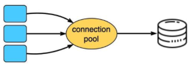

# Improve API Performance

## How to Improve API Performance?

[Original Image](https://media.licdn.com/dms/image/D5622AQEpIMPVRjy5Xw/feedshare-shrink_2048_1536/0/1704000168554?e=1710374400&v=beta&t=hUyIxTS333nIbqlswz8_SpVU2xOEFdJMXlhSZ65aDlI)

### Pagination

  - An ordinal numbering of pages
  - handles a large number of results

### Async Logging

  - send logs to a lock-free ring buffer and return
  - flush to the disk periodically
  - higher throughput and lower latency

### Caching

  - store frequently used data in the cache instead of database
  - query the database when there is a cache miss

### Payload Compression

  - reduce the data size to speed up the download and upload

### Connection Pool

  - opening and closing DB connections add significant overhead
  - a connection pool maintains a number of open connections for applications to reuse

## Improving API Performance with Database Connection Pooling

The diagram below shows 5 common API optimization techniques. Today, I’ll focus on number 5, connection pooling. It is not as trivial to implement as it sounds for some languages.

When fulfilling API requests, we often need to query the database. Opening a new connection for every API call adds overhead. 𝗖𝗼𝗻𝗻𝗲𝗰𝘁𝗶𝗼𝗻 𝗽𝗼𝗼𝗹𝗶𝗻𝗴 helps avoid this penalty by reusing connections.

𝗛𝗼𝘄 𝗖𝗼𝗻𝗻𝗲𝗰𝘁𝗶𝗼𝗻 𝗣𝗼𝗼𝗹𝗶𝗻𝗴 𝗪𝗼𝗿𝗸𝘀

1. For each API server, establish a pool of database connections at startup.
2. Workers share these connections, requesting one when needed and returning it after.

𝗖𝗵𝗮𝗹𝗹𝗲𝗻𝗴𝗲𝘀 𝗳𝗼𝗿 𝗦𝗼𝗺𝗲 𝗟𝗮𝗻𝗴𝘂𝗮𝗴𝗲𝘀

However, setting up connection pooling can be more complex for languages like PHP, Python and Node.js. These languages handle scale by having multiple processes, each serving a subset of requests.

- In these languages, database connections get tied to each process.
- Connections can't be efficiently shared across processes. Each process needs its own pool, wasting resources.

In contrast, languages like Java and Go use threads within a single process to handle requests. Connections are bound at the application level, allowing easy sharing of a centralized pool.

𝗖𝗼𝗻𝗻𝗲𝗰𝘁𝗶𝗼𝗻 𝗣𝗼𝗼𝗹𝗶𝗻𝗴 𝗦𝗼𝗹𝘂𝘁𝗶𝗼𝗻

Tools like PgBouncer work around these challenges by 𝗽𝗿𝗼𝘅𝘆𝗶𝗻𝗴 𝗰𝗼𝗻𝗻𝗲𝗰𝘁𝗶𝗼𝗻𝘀 at the application level.

PgBouncer creates a centralized pool that all processes can access. No matter which process makes the request, PgBouncer efficiently handles the pooling.

At high scale, all languages can benefit from running PgBouncer on a dedicated server. Now the connection pool is shared over the network for all API servers. This conserves finite database connections.

Connection pooling improves efficiency, but its implementation complexity varies across languages.

Have you run into database connection limit issues as your API traffic grew? How did you troubleshoot and fix that?