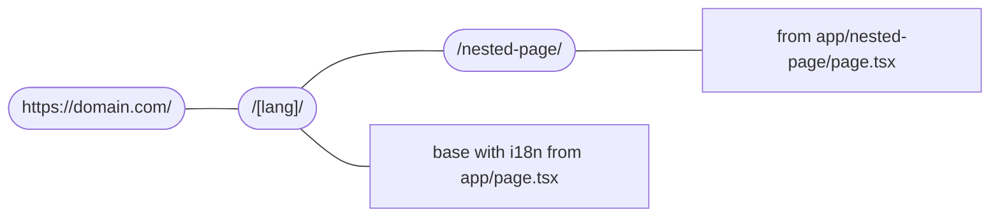

# NextJS

## Quick Start

```shell
npx create-next-app@latest --ts
```

I prefer to use `app router` and `src/`


## Folder Structure

### Main

```bash
my-website
├── src
│   ├── app/[lang]/
│   ├── assets/
│   ├── components/
│   ├── constants/
│   ├── dictionaries/
│   ├── hooks/
│   ├── lib/
│   ├── locales/
│   ├── style/
│   ├── utils/
│   ├── i18n.config.ts
│   ├── mdx-components.ts
│   └── middleware.ts
│
.
```

### App Router

[Docs](https://nextjs.org/docs/app/building-your-application/routing)


```bash
app
├── [lang]
│   ├── nested-page
│       ├── layout.tsx
│       └── page.tsx
│   ├── _components
│   ├── _config
│   ├── _hooks
│   ├── _component_on_page.tsx
│   ├── _component2_on_page.tsx
│   ├── layout.tsx
│   └── page.tsx
.
```

#### Example result




## Naming

### Component Naming

Folder use kebab-case
```txt
login-form.tsx
```

Component use PascalCase

```tsx
const LoginForm = () => {
  return (
    // ....
  )
}

export default LoginForm;
```

### Variable Naming

use camelCase for common variable and function name

```tsx
// Good
const totalPrice = calculatePrice(quantity, unitPrice);

// Bad
const x = calculatePrice(qty, price);
```

