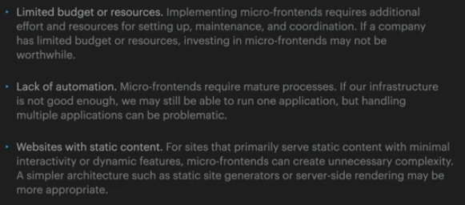
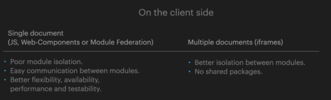

# Architecture

## Monolithic Architecture

Monolithic architecture is an approach to software development in which an application is built as a single, self-contained unit. Monolith is a starting point for many web applications.

### Use cases

- small projects with relatively straightforward requirements.
- prototyping and MVP(Minimum Viable Product) development.
- projects with a small team of maintainers.

### Anti use cases

- large-scale enterprise applications with complex and evolving requirements.
- projects where different parts of the application require different technologies or scaling strategies
- projects that many people are working on.

### Conclusion

Monolithic architecture is only suitable for small or medium-sized projects.

The main reason why we should drop out of the monolithic approach:
- the team gets bigger
- the application gets bigger

## Micro-Frontends

Micro-frontends is an architectural style where independently deliverable frontend applications are composed into a greater whole.

- With a Monolith App. scaling becomes challenging as the number of services and team members increases.

- separating responsibilities among team members becomes necessary. This separation also leads to a more flexible deployment process, allowing for faster deployment and more frequent feature delivery.

- ultimately, adopting the idea of maintaining code for different services in separate repositories transitions us from a Monolithic App to Micro-frontends.

### Clear boundaries

### Vertical Slices vs Horizontal Slices

What is better?

Horizontal slices (separation by components)
- better suited for projects containing many almost identical pages, like e-commerce sites, catalogs (e.g. Amazon).

Vertical slices (separation by pages/domains)
- better suited for web applications. A web application usually contains a limited number of pages, each responsible for  a single domain. We can easily split such a project by domain-slices. Examples of web applications: Google Calendar, Skype, Figma.

### Good

- incremental upgrades.

### Bad

### Key points

### Use cases

### Anti use cases

### Key points

### Implementation

### Server Side Template Composition

### Run time integration

### Run time integration via Webpack Module Federation

### Build time integration

### Implementation Summary

- We do not use build-time integration because of the need to recompile the application every time, which contradicts the idea of Micro-Frontend independence.

- We use service-side template composition when our site is already using server-side rendering (e.g. e-commerce sites).

## Modular Monolith

To be continue at 34.00 - Modular Monolith
https://www.youtube.com/watch?v=2qtgegNSUoE

## Reference

https://www.youtube.com/watch?v=2qtgegNSUoE