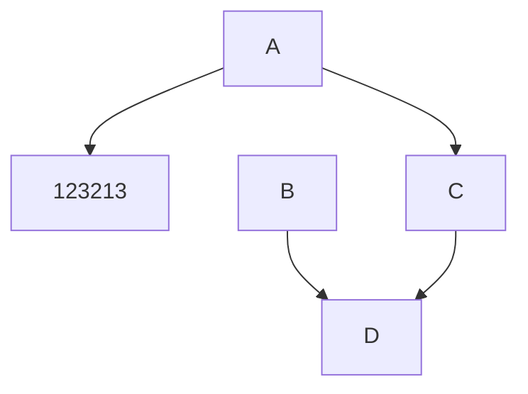

# Extension

[More](https://docusaurus.io/docs/markdown-features)

:::note

All files prefixed with an underscore (`_`) under the `docs` directory are treated as "partial" pages and will be ignored by default.

:::

:::note Customize Title

All files prefixed with an underscore (`_`) under the `docs` directory are treated as "partial" pages and will be ignored by default.

:::

:::info

Check the for an exhaustive list of options.

:::

:::tip

Tips

:::

:::warning

Warning

:::

:::danger

Danger

:::

<details>

<summary>Markdown is declarative</summary>

Some may assume a 1-1 correlation between Markdown and HTML, e.g., `` will always become ``, as-is. However, _that is not the case_.

The Markdown syntax `` only declaratively tells Docusaurus that an image needs to be inserted here, but we may do other things like transforming a [file path to URL path](./markdown-features-assets.mdx#images), so the generated markup may differ from the output of other Markdown renderers, or a naïve hand-transcription to the equivalent JSX/HTML code.

In general, you should only assume the _semantics_ of the markup (` ``` ` fences become [code blocks](./markdown-features-code-blocks.mdx); `>` becomes [quotes](#quotes), etc.), but not the actual compiled output.

</details>

## Diagram



