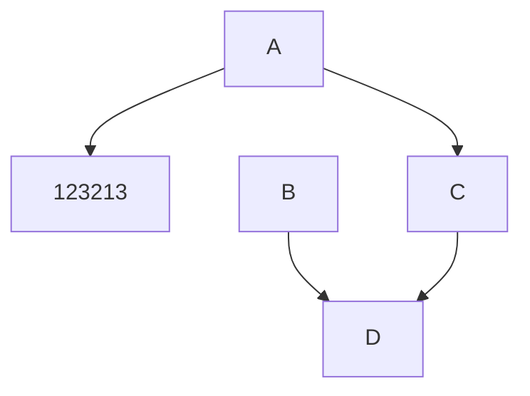

# Extension

[More](https://docusaurus.io/docs/markdown-features)

:::note

All files prefixed with an underscore (`_`) under the `docs` directory are treated as "partial" pages and will be ignored by default.

:::

:::note Customize Title

All files prefixed with an underscore (`_`) under the `docs` directory are treated as "partial" pages and will be ignored by default.

:::

:::info

Check the for an exhaustive list of options.

:::

:::tip

Tips

:::

:::warning

Warning

:::

:::danger

Danger

:::

Markdown is declarative

Some content 

## Diagram

