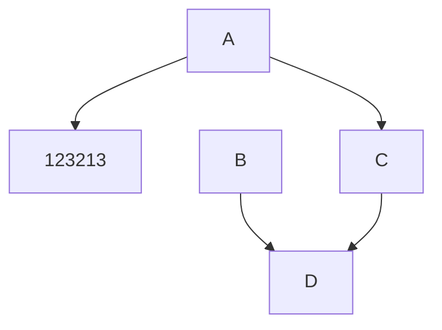
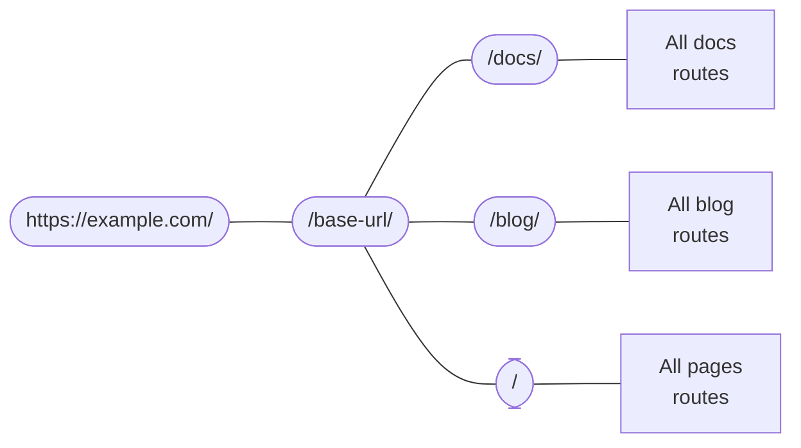

# Extension

import BrowserWindow from '@site/src/components/BrowserWindow';
import Tabs from '@theme/Tabs';
import TabItem from '@theme/TabItem';

[More](https://docusaurus.io/docs/markdown-features)

:::note

All files prefixed with an underscore (`_`) under the `docs` directory are treated as "partial" pages and will be ignored by default.

:::

:::note Customize Title

All files prefixed with an underscore (`_`) under the `docs` directory are treated as "partial" pages and will be ignored by default.

:::

:::info

Check the for an exhaustive list of options.

:::

:::tip

Tips

:::

:::warning

Warning

:::

:::danger

Danger

:::

<details>

<summary>Markdown is declarative</summary>

Some content 

</details>

## Diagram





```mdx-code-block
<BrowserWindow>
```

```jsx live
function Clock(props) {
  const [date, setDate] = useState(new Date());
  useEffect(() => {
    const timerID = setInterval(() => tick(), 1000);

    return function cleanup() {
      clearInterval(timerID);
    };
  });

  function tick() {
    setDate(new Date());
  }

  return (
    <div>
      <h2>It is {date.toLocaleTimeString()}.</h2>
    </div>
  );
}
```

```mdx-code-block
</BrowserWindow>
```

You can declare custom magic comments through theme config. For example, you can register another magic comment that adds a `code-block-error-line` class name:

```mdx-code-block
<Tabs>
<TabItem value="docusaurus.config.js">
```

```js
export default {
  themeConfig: {
    prism: {
      magicComments: [
        // Remember to extend the default highlight class name as well!
        {
          className: 'theme-code-block-highlighted-line',
          line: 'highlight-next-line',
          block: {start: 'highlight-start', end: 'highlight-end'},
        },
        // highlight-start
        {
          className: 'code-block-error-line',
          line: 'This will error',
        },
        // highlight-end
      ],
    },
  },
};
```

```mdx-code-block
</TabItem>
<TabItem value="src/css/custom.css">
```

```css
.code-block-error-line {
  background-color: #ff000020;
  display: block;
  margin: 0 calc(-1 * var(--ifm-pre-padding));
  padding: 0 var(--ifm-pre-padding);
  border-left: 3px solid #ff000080;
}
```

```mdx-code-block
</TabItem>
<TabItem value="myDoc.md">
```

````md
In JavaScript, trying to access properties on `null` will error.

```js
const name = null;
// This will error
console.log(name.toUpperCase());
// Uncaught TypeError: Cannot read properties of null (reading 'toUpperCase')
```
````

```mdx-code-block
</TabItem>
</Tabs>
```