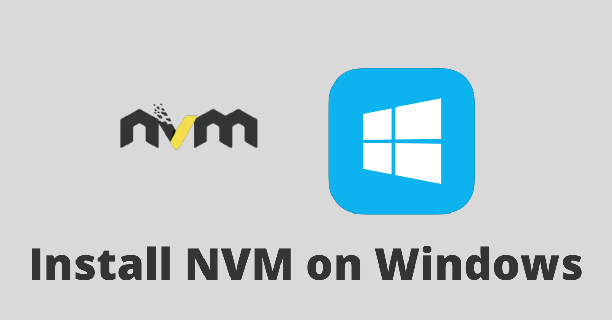
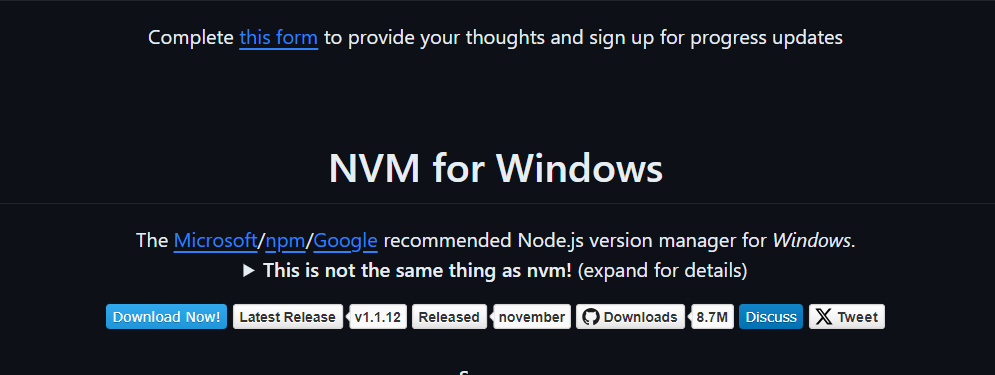
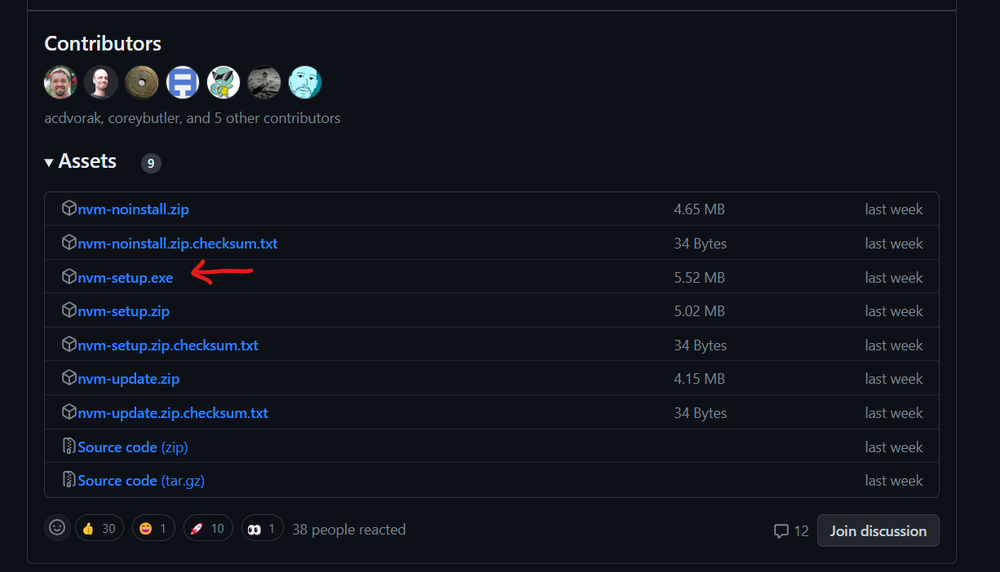
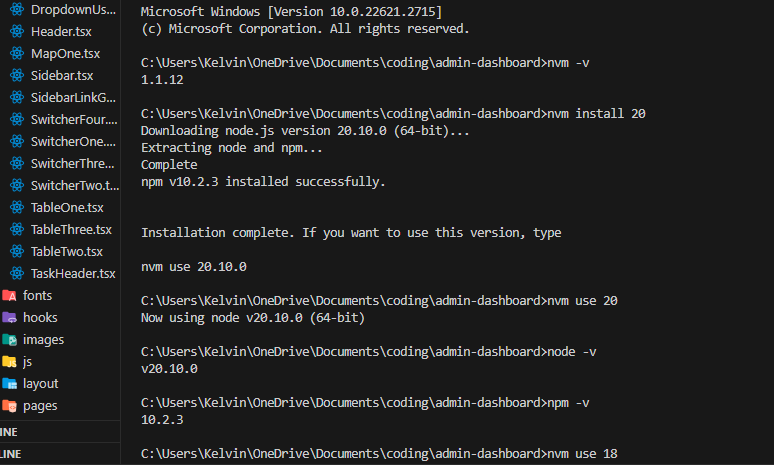

# NVM 

## NVM for Windows

Doesn't Windows have "NVM"? Because NVM is only supported on Linux and Mac? No! There is also a Node Version Manager (NVM) for Windows too! How to Download and Install Node Version Manager (NVM) in Windows.

Follow the steps below to download nvm-windows

Step 1: Head over to the nvm-windows repository and click on "Download Now!"

[Download Link](https://github.com/coreybutler/nvm-windows#installation--upgrades)

Step 2: Scroll down and click on the latest version to download.

Step 3: Locate the installer on your computer and open it. Follow the installation wizard to install it.

Step 4: Open up PowerShell or Command Prompt and run nvm -v to confirm the installation.

### Example Usage

