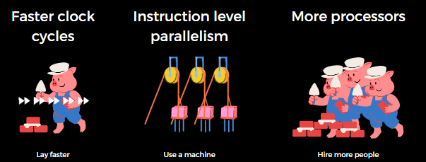
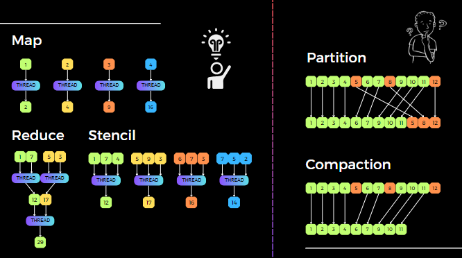
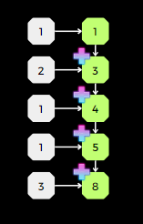
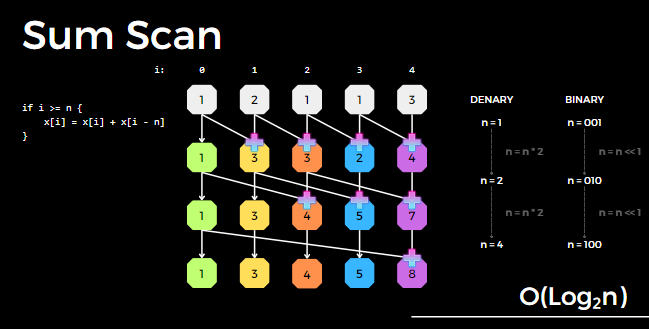
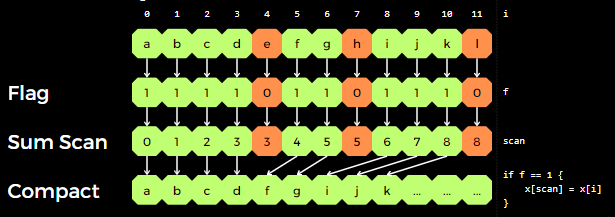
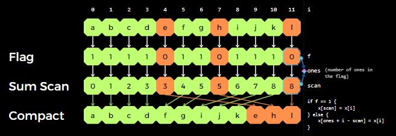
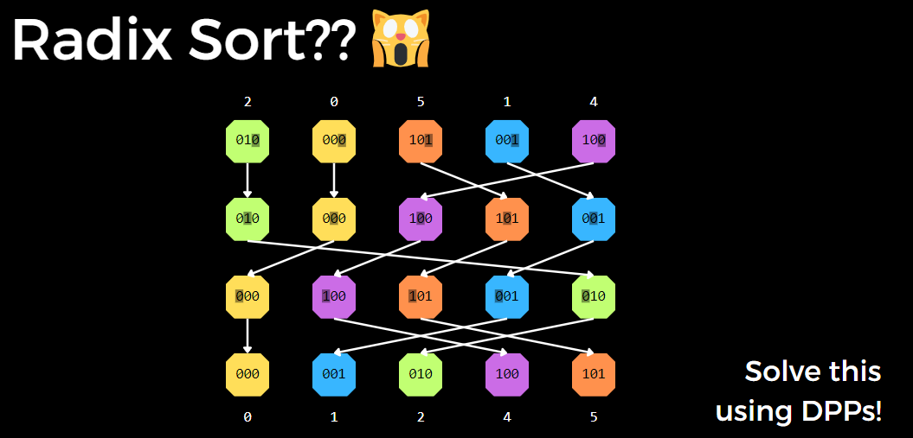
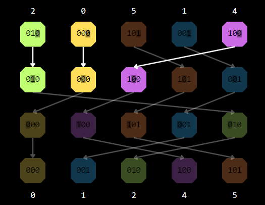
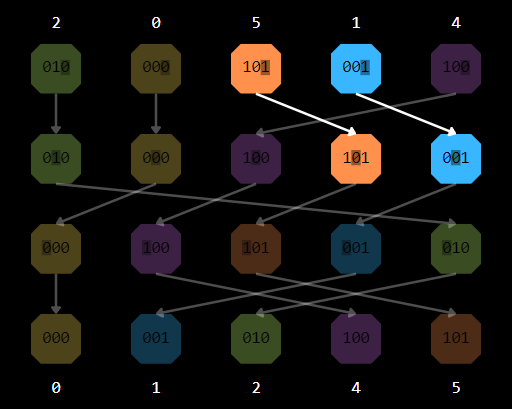
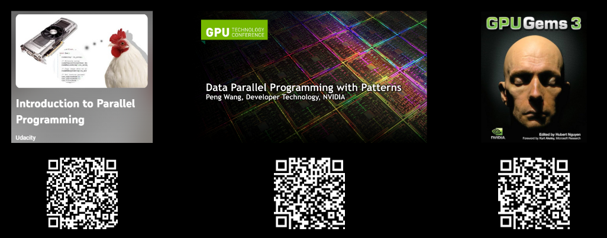

# Parallel Computing

## Introduction

## 1 Laying Bricks

* lay faster
* use a machine
* hire more people

### Analogy

* faster clock cycles
* instrcution level parallelism
* more processors

## 2 Software Parallelism

* subset of concurrency

What is software parallelism?

* Divide the work into units of tasks.
* Run independently.
* No dependencies from other tasks.
* Can be executed simultaneously

## 3 Data-Parallel Primitives (DPP)

* building blocks
* commonly used patterns
* combined to create complex parallel algorithms
* reuse existing high performance implementations

### Common Types of DPP

Map, Stencil, Reduce, Scan, 
Gather/scatter, Compaction, Partition

* Sum Scan

[Big O Notation-Please explain O(log2n)](https://stackoverflow.com/questions/46996540/big-o-notation-please-explain-olog2n)

* Compaction

* Partition

* Radix Sort

## 4 Conclusion

* Thread count (hardware is still important)
* Write/mutate data (utilize atomics if necessary)
* Graph coloring
  - A graph coloring is an assignment of labels, called colors, to the vertices of a graph such that no two adjacent vertices share the same color.
* Memory is slow
* Beware of branching
* Data structures
* Use DPP to express your algorithm

